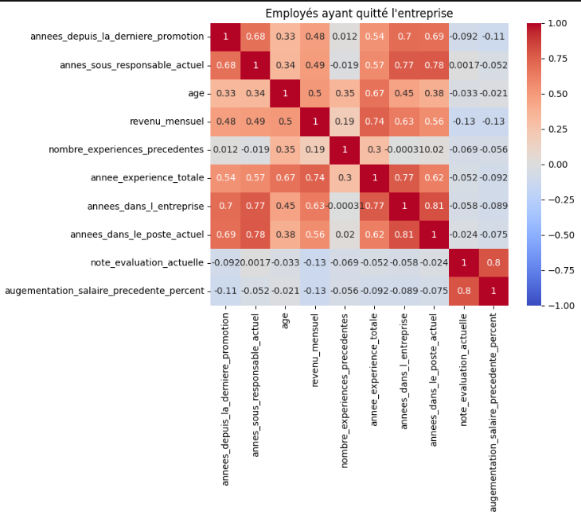
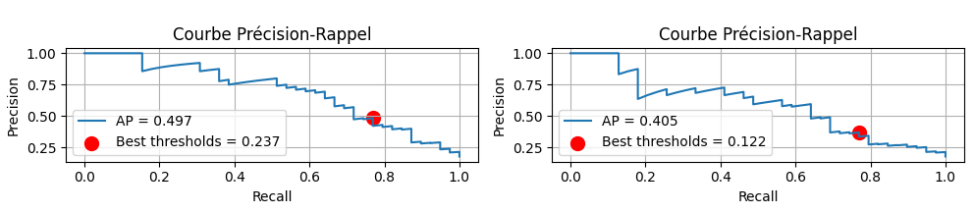
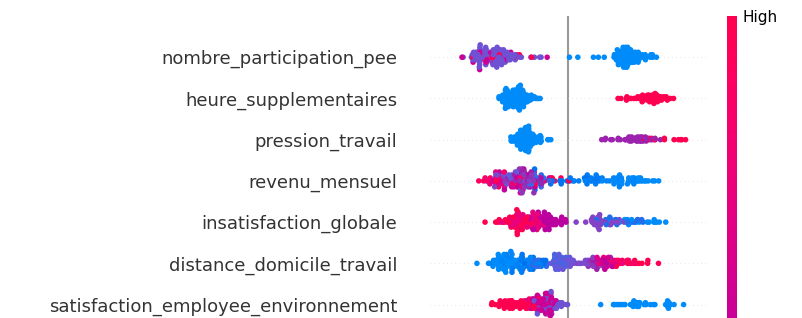
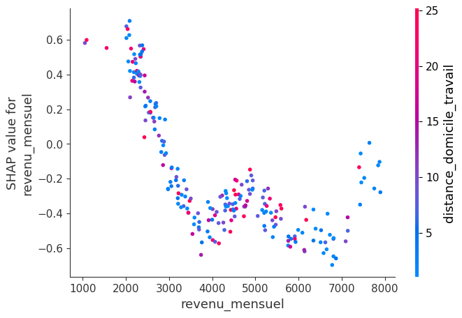
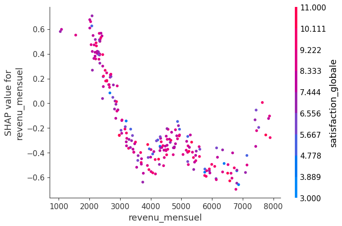
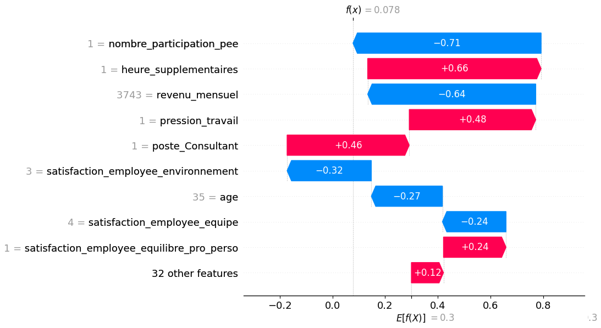
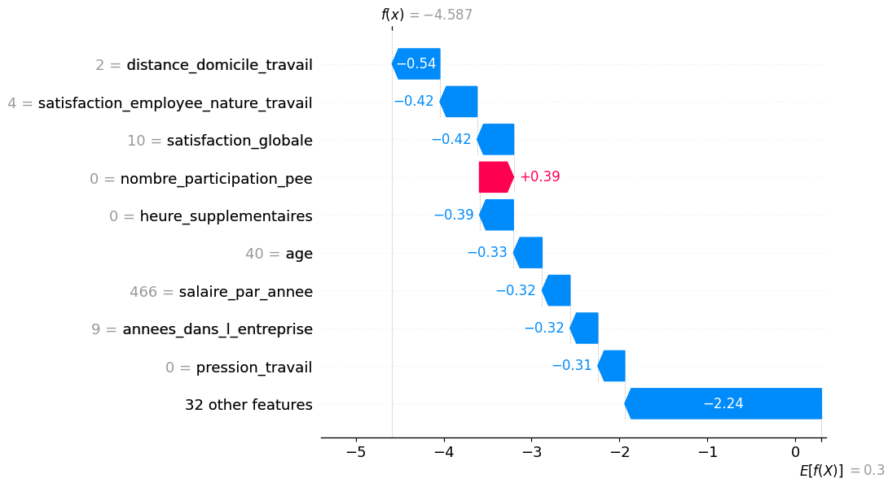

# Demande

Corrections à apporter sous 48h soit avant dimanche 21 juin 9h :

1. Compléter le pyproject.toml avec toutes les dépendances utilisées.
2. Ajouter un boxplot intégrant la cible a_quitte_l_entreprise.
3. Ajouter deux transformations réelles avec .apply().
4. Montrer explicitement la suppression de variables redondantes à partir de la matrice de corrélation.
5. Clarifier ou renforcer l’encodage des variables qualitatives.
6. Ajouter la stratification dans le train_test_split.
7. Ajouter moyenne et écart-type des métriques en validation croisée.
8. Ajouter la courbe Précision-Rappel.
9. Justifier le seuil de classification à partir de cette courbe.
10. Exécuter réellement la GridSearch et afficher les meilleurs paramètres.
11. Ajouter une seconde méthode de feature importance globale.
12. Ajouter Beeswarm SHAP, deux SHAP scatter plots colorés et deux waterfall plots
13. Corriger les conclusions métier trop affirmatives : causes racines, salaire, heures supplémentaires.
14. Clarifier le risque de data leakage lié au sondage.
15. Corriger les incohérences de la matrice de confusion, du recall et des faux positifs.
16. Réexécuter tous les notebooks dans l’ordre et mettre à jour la présentation avec les résultats corrigés.
17. Ajouter une diapo de recommandations RH formalisées, avec des conseils  opérationnels directement reliés aux résultats de l’étude.


# Actions

Voici les actions mises en place pour corriger les manquements.

## 1. Compléter le pyproject.toml avec toutes les dépendances utilisées.

Voici l'arbre des dépendances créé avec `uv tree`.

```
technova v0.1.0
├── dice-ml v0.12
│   ├── jsonschema v4.26.0
│   │   ├── attrs v26.1.0
│   │   ├── jsonschema-specifications v2025.9.1
│   │   │   └── referencing v0.37.0
│   │   │       ├── attrs v26.1.0
│   │   │       ├── rpds-py v2026.5.1
│   │   │       └── typing-extensions v4.15.0
│   │   ├── referencing v0.37.0 (*)
│   │   └── rpds-py v2026.5.1
│   ├── lightgbm v4.6.0
│   │   ├── numpy v2.4.6
│   │   └── scipy v1.17.1
│   │       └── numpy v2.4.6
│   ├── numpy v2.4.6
│   ├── pandas v3.0.3
│   │   ├── numpy v2.4.6
│   │   ├── python-dateutil v2.9.0.post0
│   │   │   └── six v1.17.0
│   │   └── tzdata v2026.2
│   ├── raiutils v0.4.2
│   │   ├── numpy v2.4.6
│   │   ├── pandas v3.0.3 (*)
│   │   ├── requests v2.34.2
│   │   │   ├── certifi v2026.6.17
│   │   │   ├── charset-normalizer v3.4.7
│   │   │   ├── idna v3.18
│   │   │   └── urllib3 v2.7.0
│   │   ├── scikit-learn v1.9.0
│   │   │   ├── joblib v1.5.3
│   │   │   ├── narwhals v2.22.0
│   │   │   ├── numpy v2.4.6
│   │   │   ├── scipy v1.17.1 (*)
│   │   │   └── threadpoolctl v3.6.0
│   │   └── scipy v1.17.1 (*)
│   ├── scikit-learn v1.9.0 (*)
│   ├── tqdm v4.68.2
│   │   └── colorama v0.4.6
│   └── xgboost v3.2.0
│       ├── numpy v2.4.6
│       └── scipy v1.17.1 (*)
├── fastparquet v2026.5.0
│   ├── cramjam v2.11.0
│   ├── fsspec v2026.4.0
│   ├── numpy v2.4.6
│   ├── packaging v26.2
│   └── pandas v3.0.3 (*)
├── ipykernel v7.2.0
│   ├── comm v0.2.3
│   ├── debugpy v1.8.20
│   ├── ipython v9.14.0
│   │   ├── colorama v0.4.6
│   │   ├── decorator v5.3.1
│   │   ├── ipython-pygments-lexers v1.1.1
│   │   │   └── pygments v2.20.0
│   │   ├── jedi v0.20.0
│   │   │   └── parso v0.8.7
│   │   ├── matplotlib-inline v0.2.2
│   │   │   └── traitlets v5.15.0
│   │   ├── prompt-toolkit v3.0.52
│   │   │   └── wcwidth v0.7.0
│   │   ├── psutil v7.2.2
│   │   ├── pygments v2.20.0
│   │   ├── stack-data v0.6.3
│   │   │   ├── asttokens v3.0.1
│   │   │   ├── executing v2.2.1
│   │   │   └── pure-eval v0.2.3
│   │   └── traitlets v5.15.0
│   ├── jupyter-client v8.8.0
│   │   ├── jupyter-core v5.9.1
│   │   │   ├── platformdirs v4.10.0
│   │   │   └── traitlets v5.15.0
│   │   ├── python-dateutil v2.9.0.post0 (*)
│   │   ├── pyzmq v27.1.0
│   │   ├── tornado v6.5.6
│   │   └── traitlets v5.15.0
│   ├── jupyter-core v5.9.1 (*)
│   ├── matplotlib-inline v0.2.2 (*)
│   ├── nest-asyncio v1.6.0
│   ├── packaging v26.2
│   ├── psutil v7.2.2
│   ├── pyzmq v27.1.0
│   ├── tornado v6.5.6
│   └── traitlets v5.15.0
├── matplotlib v3.10.9
│   ├── contourpy v1.3.3
│   │   └── numpy v2.4.6
│   ├── cycler v0.12.1
│   ├── fonttools v4.63.0
│   ├── kiwisolver v1.5.0
│   ├── numpy v2.4.6
│   ├── packaging v26.2
│   ├── pillow v12.2.0
│   ├── pyparsing v3.3.2
│   └── python-dateutil v2.9.0.post0 (*)
├── pandas v3.0.3 (*)
├── scikit-learn v1.9.0 (*)
├── seaborn v0.13.2
│   ├── matplotlib v3.10.9 (*)
│   ├── numpy v2.4.6
│   └── pandas v3.0.3 (*)
├── shap v0.52.0
│   ├── cloudpickle v3.1.2
│   ├── llvmlite v0.47.0
│   ├── numba v0.65.1
│   │   ├── llvmlite v0.47.0
│   │   └── numpy v2.4.6
│   ├── numpy v2.4.6
│   ├── packaging v26.2
│   ├── pandas v3.0.3 (*)
│   ├── scikit-learn v1.9.0 (*)
│   ├── scipy v1.17.1 (*)
│   ├── slicer v0.0.8
│   └── tqdm v4.68.2 (*)
└── xgboost v3.2.0 (*)
(*) Package tree already displayed
```

et voici les dépendances enregistrées dans `pyproject.toml`

```toml
dependencies = [
    "dice-ml>=0.12",
    "fastparquet>=2026.5.0",
    "ipykernel>=7.2.0",
    "matplotlib>=3.10.9",
    "pandas>=3.0.3",
    "scikit-learn>=1.9.0",
    "seaborn>=0.13.2",
    "shap>=0.52.0",
    "xgboost>=3.2.0",
]
```

Ce dernier correspond à la racine des dépendances créé avec `uv add`, donc techniquement il ne manque pas de dépendances au projet.

Cependant, nous pouvons partir du principe que les sous-dépendances utilisées par les `import` dans le code doivent être importées individuellement à la racine, dans ce cas voici les dépendances manquantes:

```toml
dependencies = [
    "numpy>=2.4.6"
]
```

Un test de recréation d'un nouvel environnement virtuel à l'aide de `uv sync` confirme ce cas.

## 2. Ajouter un boxplot intégrant la cible a_quitte_l_entreprise.

Ajout au note book `2.exploration.ipynb`

## 3. Ajouter deux transformations réelles avec .apply().

**1er cas**

Le code:

```python
df["est_un_homme"] = (df["genre"] == "M").astype(bool)
```

devient

```python
df["est_un_homme"] = df["genre"].apply(
    lambda x: x == "M" if True else False
)
```

pour le même résultat.

**2eme cas**

Le code:

```python
df["augementation_salaire_precedente"] = df["augementation_salaire_precedente"].str[:-1].astype(int)
df.rename(columns={"augementation_salaire_precedente": "augementation_salaire_precedente_percent"}, inplace=True)
```

devient

```python
df["augementation_salaire_precedente"] = df["augementation_salaire_precedente"].apply(
    lambda x: x[:-1]
).astype(int)
```

pour le même résultat.

## 4.Montrer explicitement la suppression de variables redondantes à partir de la matrice de corrélation.

En reprenant la matrice de corrélation du fichier `2.exploration.ipynb`



Une règle classique est de définir un seuil de tolérance, généralement **0.8** au dessus duquel nous pouvons dire qu'une variable est redondante.

**cas 1**

En prenant le seuil le plus haut: **0.81**, nous pouvons dire que les 2 variables suivantes sont clairement redondantes :

```
annees_dans_l_entreprise
annees_dans_le_poste_actuel
```

Il est logique de penser pour une personne n'ayant jamais changé de poste d'être corrélé au nombres d'années dans l'entreprise. Mais une personne frustré dans son dernier poste peut être une cause de départ au sens métier.

**cas 2**

Les 2 autres variables atteignant ce seuil est 

```
augementation_salaire_precedente_percent
note_evaluation_actuelle
```

Sont également redondante mais au sens métier peuvent avoir un intérêt distinct car elles n'indiquent pas la même chose. 

**résultat**

Pour le moment il est trop tôt pour supprimer l'une des 2 variables car elles peuvent être utile au modèle.

Il faut pousser l'analyse un peu plus loin en vérifiant la corrélation avec la cible ainsi que les features importances.

## 5. Clarifier ou renforcer l’encodage des variables qualitatives.

Dans le cas des variables qualitatives du modèle:

* domaine_etude
* statut_marital
* departement
* poste
* frequence_deplacement


Nous vérifions les valeurs uniques pour identifier le sens métier des valeurs:

```python
df["domaine_etude"].unique()
```


**frequence_deplacement (ordinal)**

Est une variable ordinal, car on peut en déduire un ordre claire: `Aucun < Occasionnel < Fréquent`

Il est directement convertie en variable numérique discrète : `0 < 1 < 2`

```python
df["frequence_deplacement"] = df["frequence_deplacement"].map({
    "Aucun": 0,
    "Occasionnel": 1,
    "Frequent": 2
}).astype(int)
```


**poste (nominal)**

Poste représente le poste du salarié dans l'entreprise, il pourrait être tentant de l'ordonné car on y vois une hiérarchie au premier abord.

Cependant, certains poste sont difficilement plaçable dans cette ordonnancement car ne faisant pas partie du même domaine.

C'est pour cela que la variable est convertie en encodage One-Hot-Encoding en supprimant la première classe "implicite" pour na pas fausser le modèle avec une catégorie fictive ou toutes les valeurs serait à zéro en plus de toutes les autres catégories (1 seul colonne reçoit 1 et les autres 0)

```python
df = pd.get_dummies(df, columns=["poste"], drop_first=True)
```


**departement (nominal)**

Le département [Consulting, Commercial, Ressources Humaines] est clairement nominal.

```python
df = pd.get_dummies(df, columns=["departement"], drop_first=True)
```


**domaine_etude (nominal)**

Le domaine d'étude [Infra & Cloud, Transformation Digitale, Marketing, Entrepreunariat, Autre, Ressources Humaines] est clairement nominal, il n'y a pas d'ordre logique.

```python
df = pd.get_dummies(df, columns=["domaine_etude"], drop_first=True)
```


**statut_marital (nominal)**

Le Statut Marital [Divorcé(e), Célibataire, Marié(e)] est clairement nominal, il n'y a pas d'ordre logique.

```python
df = pd.get_dummies(df, columns=["statut_marital"], drop_first=True)
```


## 6. Ajouter la stratification dans le train_test_split.

Pour ajouter de la stratification, càd, équilibrer les classes entre le jeu de test et d'entrainement nous pouvons utiliser le paramètres `stratify` de la fonction `train_test_split`.

Ce paramètre est ajouté directement à la fonction existante `separation_train_test` car elle ne peut être que positive par rapport aux modèles. 

Fichier : `3.modelisations.ipynb`


## 7. Ajouter moyenne et écart-type des métriques en validation croisée.

Le code initial test la validation croisé (avant la dernière étape de choix du seuil) avec la fonction `cross_validate`  avec un `scoring="recall"`

les métriques affichés sont: le score brut, la moyenne et la distribution de chaque fold.

Il manque donc l'écart-type: 

```python
return {
        "recall_cross" : scores.round(3),
        "recall_cross_mean" : scores.mean(),
        "recall_cross_std" : scores.std(),
        "recall_cross_dist" : dist
        }
```

Fichier : `3.modelisations.ipynb`


## 8. Ajouter la courbe Précision-Rappel.

La fonction `display_results` permet d'afficher les résultats obtenu par l'entrainement, la courbe Précision-Rappel est calculé à ce moment à partir des données de la passe en cours.


## 9. Justifier le seuil de classification à partir de cette courbe.

L'Average Precision mesure la capacité du modèle à **identifier correctement la classe positive** (`a_quitte_l_entreprise = 1`) tout en limitant les faux positifs. 

LogisticRegression (AP = 0,496) et nettement au dessous du modèle XGBoost (AP = 0.96)


Avec la méthode existante, le seuil est automatiquement choisi en réalisant plusieurs prédictions avec des seuils progressif. Elle permet d'obtenir un équilibre entre la détection des départs potentiels et la limitation des fausses alertes en comparant le F1-Score.


Visuellement, on recherche souvent le "coude" de la courbe :

- une zone où le recall augmente encore fortement ;
- sans que la précision chute brutalement.


Il faut donc choisir un compromis entre recall et précision, dans notre cas il s'agit du recall mais sans sacrifié le précision.

Les seuils calculés automatiquement sont:

```
LogisticRegression Best threshold: 0.5
XGBoost Best threshold: 0.4
```

Si on souhaite s'en tenir au meilleur équilibre le choix automatique est cohérant.

Pour privilégié le recall (et maximiser les vrais positifs) nous pouvons fixer une règle: "détecter au moins 75 % des employés qui vont quitter l'entreprise".

Dans ce cas: nous gardons uniquement les seuils avec un **recall >= 0.75** et parmi ces candidats celui qui aura **la meilleur précision**.


La méthode `display_results` affiche le meilleur seuil basé sur l'obectif du recall (ici LogisticRegression / XGBoost):



> ATTENTION ... Un meilleur recall sera au détriment de la précision.

Fichier : `3.modelisations.ipynb`


## 10. Exécuter réellement la GridSearch et afficher les meilleurs paramètres.

Dans la section `recherche des hyper paramètres`, le **GridSearch** affiche maintenant les meilleurs paramètres.

Fichier : `3.modelisations.ipynb`


## 11. Ajouter une seconde méthode de feature importance globale.

La première méthode est la **SHAP Global Importance**, elle définit:

"Quelles variables ont eu le plus d'impact, en moyenne, sur les prédictions du modèle ?"


La 2eme méthode est la **Permutation Importance**, elle définit:

"Si on détruit l'information contenue dans cette variable, combien la performance du modèle se dégrade ?"


Nous avons donc 2 interprétations et donc 2 résultat différents.

 **SHAP Global Importance**

`nombre_participation_pee` est globalement la variable qui influence le plus les décisions du modèle.

```
                                feature  importance
0              nombre_participation_pee    0.518524
17                heure_supplementaires    0.485029
6                        revenu_mensuel    0.392165
39                     pression_travail    0.387584
11  satisfaction_employee_environnement    0.358142
40               insatisfaction_globale    0.333321
5                                   age    0.317241
2             distance_domicile_travail    0.298639
7        nombre_experiences_precedentes    0.263935
3                 frequence_deplacement    0.256260
```

 **Permutation Importance**

`distance_domicile_travail` est la variable dont la suppression dégrade le plus les performances du modèle.

```
                                 feature  importance
2              distance_domicile_travail    0.030734
5                                    age    0.021560
17                 heure_supplementaires    0.020642
34                   anciennete_relative    0.016514
0               nombre_participation_pee    0.015138
7         nombre_experiences_precedentes    0.014679
8                annee_experience_totale    0.014220
14  satisfaction_employee_nature_travail    0.011927
6                         revenu_mensuel    0.010092
26                departement_Consulting    0.009174
```

Fichier : `3.modelisations.ipynb`


## 12. Ajouter Beeswarm SHAP, deux SHAP scatter plots colorés et deux waterfall plots

**Beeswarm SHAP (importance globale)** est représenté par un graphique où les features sont classé par importances. La couleur rouge indique une valeur haute et la couleur bleue une la valeur basse. A gauche la prédiction -/+ de la cible.




**Deux SHAP scatter plots colorés** met en relation 2 features importances dans un graphique points.

Ici : on voit la tendance de `revenu_mensuel` par rapport à l'impact SHAP, la couleur indique couleur l'influence de la seconde variable `distance_domicile_travail`. La couleur indique la distance domicile/travail.



Interprétation:

> La distance est plutôt diffuse, elle n'apporte pas de corrélation avec le revenu. Cependant, les employés avec un revenu bas impact plus le modèle dans la prise de décision.


Ici : pour la même variable, nous la mettons en correspondance avec `satisfaction_globale`. La couleur indique la satisfaction globale.



Interprétation:

> La satisfaction est plutôt diffuse, elle n'apporte pas de corrélation avec le revenu. Cependant, les employés avec un revenu bas impact plus le modèle dans la prise de décision.


**Deux waterfall plots**

Les waterfall plots expliquent des cas individuels.

Lecture :

- `base value` → prédiction moyenne du modèle ;
- flèches rouges → variables augmentant le risque de départ ;
- flèches bleues → variables diminuant le risque ;
- valeur finale → probabilité prédite.


Nous prenons 2 salariés, l'un démissionnaire et l'autre restant, et analysons influence des variables sur les causes d'augmentation / diminution de départ.

**Premier cas (à démissionné)**

Ici le revenu mensuel et 1 participation au PEE contribue à diminuer le risque de départ. Mais la pression au travail, les heures supplémentaires et le poste ajouté à la base (0.3) fait pencher la balance vers un risque de départ.



**Deuxième cas (est resté)**

Ici le salarié accumule beaucoup plus de points positif avec une distance domicile/travail faible, une meilleur satisfaction globale, aucune heure supplémentaire. Certes, avec aucune participation PEE mais une moyenne de risque faible.




Fichier : `3.modelisations.ipynb`


## 13. Corriger les conclusions métier trop affirmatives : causes racines, salaire, heures supplémentaires.


L’analyse met en évidence plusieurs facteurs associés au risque de départ, notamment la pression ressentie au travail, certains indicateurs liés à la rémunération et la charge de travail. Ces éléments doivent être interprétés comme des signaux d’alerte plutôt que comme des causes racines avérées. Des analyses complémentaires (entretiens collaborateurs, analyse RH, étude des parcours professionnels) seraient nécessaires pour confirmer les causes réelles de départ et définir des actions adaptées. 

Les valeurs SHAP montrent quelles variables influencent le plus la décision du modèle pour les individus analysés. Elles expliquent la prédiction du modèle mais ne permettent pas d’affirmer qu’une modification de ces variables entraînerait nécessairement une diminution des départs. 


## 14. Clarifier le risque de data leakage lié au sondage.


Les résultats du modèle doivent être interprétés avec prudence en raison d’un risque potentiel de data leakage associé aux variables issues du sondage collaborateur. Une validation complémentaire devra confirmer que ces variables sont disponibles suffisamment en amont du départ et qu’elles ne reflètent pas directement une intention de quitter l’entreprise. Dans le cas contraire, elles devront être retirées afin d’obtenir une estimation réaliste des performances du modèle. 


Ces variables sont:

* note_evaluation_actuelle
* satisfaction_employee_*


## 15. Corriger les incohérences de la matrice de confusion, du recall et des faux positifs.

Les diapo 39 et 40 expliquent l'interprétation des matrices de confusions LogisticRegression et XGBoost.

Fichier : `Presentation.pptx`


## 16. Réexécuter tous les notebooks dans l’ordre et mettre à jour la présentation avec les résultats corrigés

Fait

Fichier : `Presentation.pptx`


## 17. Ajouter une diapo de recommandations RH formalisées, avec des conseils  opérationnels directement reliés aux résultats de l’étude.

La diapo 43, 44 et 45 expliquent les analyses et les recommandations RH.

Fichier : `Presentation.pptx`

